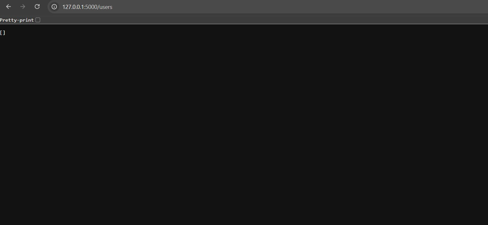
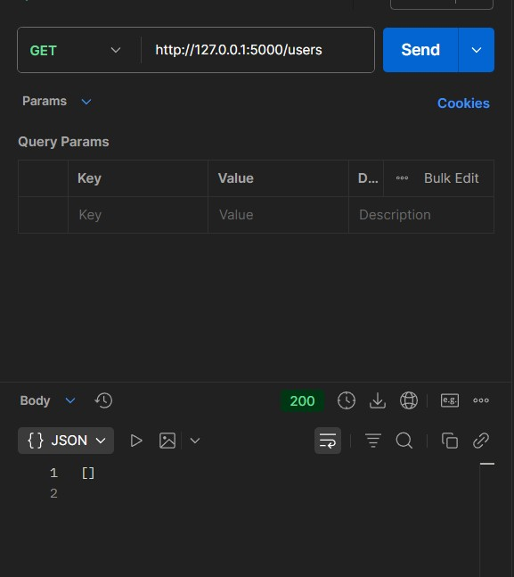
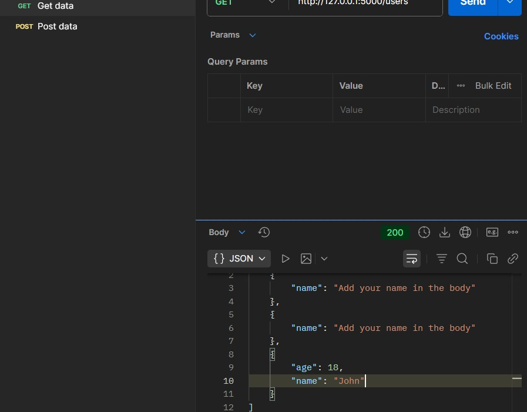
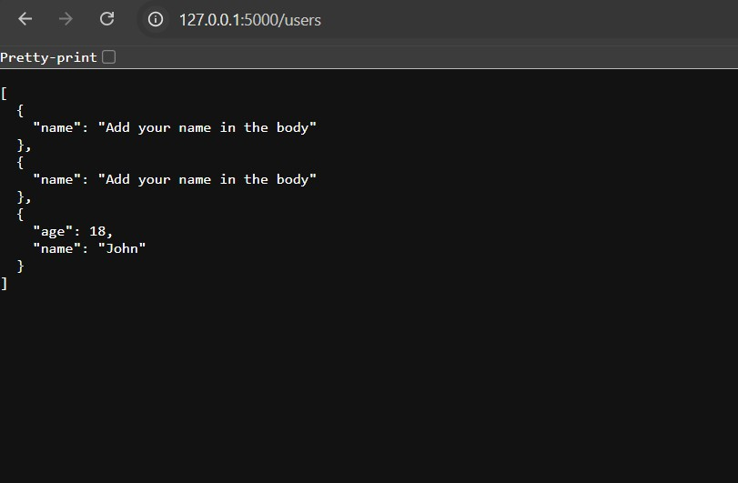

# Flask REST API Project

This project is a simple REST API built using Flask.

Features:
- GET users
- POST add user
- PUT update user
- DELETE user

Tools:
Python, Flask, Postman

Run:
pip install flask
python app.py

API URL:
http://127.0.0.1:5000/users

## Output Screenshot

